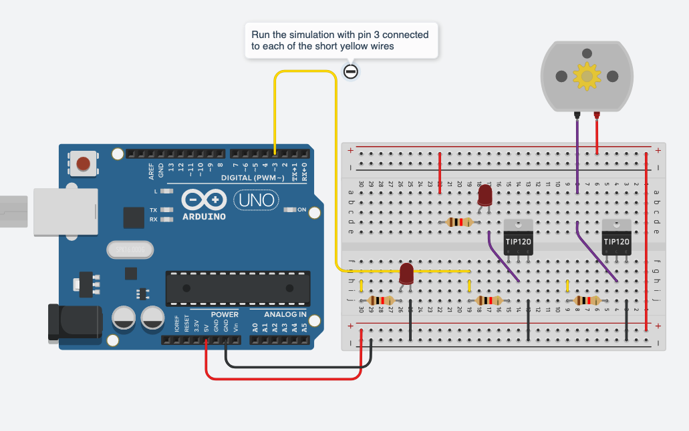

# tangible code samples
## W05 - Ananlog Out (AO) and motors.

### 00-RGB-blink-working

Picking up on W04 code samples -- blinks an RGB led using digital write commands.

### 01-SET-RGB-analog

Manually set a color on an RGB led using
````
analogWrite(pin,state);
````
With analogWrite more than 1.6 million colors are now (theoretically) possible with each RGB LED.

Note that
````
digitalWrite(pin,1);
````
and

````
analogWrite(pin,255);
````

are experientially the same.

### 02-R-fade-FORloop

-- Fade an RGB LED with a FOR...loop.

-- for loops are one way to count with an Arduino.

-- open the serial port to see how *loop* and *brightness* relate in time. ( All brightnesses happen in each loop. )

### 03-RB-crossFade

-- minor variation on above.

-- for second color channel we set brightness to :

```
255 - brightness

```
This has the affect of counting down as the loop increases.  We use 255 because it the max value of the loop.

### 04-IF-then-fade-class

-- does not work out of the box -- we modded it in class

-- it requires you to extend the control of a single LED (r-channel of RGB) to control of three LED (RGB).

### 05-IF-THEN-fade-working

-- functioning version of 04 above.

-- this fade version uses IF...THEN to control brightness.

-- brightness state for each channel is written to the LEDS, incremented and then checked against limits (0 and 255).  You should try other limits. (This is analogous to the example of moving a ball back and forth on a screen in p5js).

NOTE the structural similarity between a FOR...loop and an IF...THEN.  they have upper and lower limits, they have an increment and variable to hold brightness.

*But there is a big difference too:*

-- open the serial port to see how *loop* and *brightness* relate in time. ( Every loop has a NEW brightness -- compare to 02 above ).

-- open the serial plotter to see the brightness pathways for each LED

### 06-IF-THEN-branches

-- similar to above but with a conditional color switch

-- lines 63-66 change one channel based on states of other channels.

````
if (rBrightness == 130 && gBrightness == 125) {
  bBrightness = 0;
  bStep = -1;
}
````
Try other ways to make colors dependant on one an other.

### 10-rgb_functions_demo

From the post
[https://tangiblemedia.ca/code-blocks/functions/](https://tangiblemedia.ca/code-blocks/functions/)

This code can be used to set RGB via a function and array.


### 15-exp-easeTOrnd

Just playing around to see if I could get non-linear fades on an LED.

There are almost certainly other cleaner methods.

A random brightness for one color-channel is picked and the LED is eased towards that value.

Open the serial plotter to see the new target and the easing.  I found that by constraining the system to less than 40 for max brightness made the non-linearity easier to see. YMWV.

Could be pushed A LOT further.

## Transistors, motors solenoids.

With the TIP122 transistor circuit setup you can blink a motor with the same code used to blink an LED.

And you can fade a motor (control its speed) with the same code that fades an LED.

Check out this simulation -- move the wire from pin 3 to each short yellow wire to see the various circuits activate.  Run the simulation for each circuit.

<a href="https://www.tinkercad.com/things/ddzchuJPdsd-transistor-example/editel" target="_blank"></a>

Code from simulation.

````
int transistorPin = 3;


void setup()
{
  pinMode(transistorPin, OUTPUT);
}

void loop()
{

  // digital control
  digitalWrite(transistorPin, HIGH);
  delay(1000); // Wait for 1000 millisecond(s)
  digitalWrite(transistorPin, LOW);
  delay(1000); // Wait for 1000 millisecond(s)

  // // analog control
  // for ( int amount = 0; amount < 255; amount++){
  //   analogWrite(transistorPin, amount);
  // }

}
````
